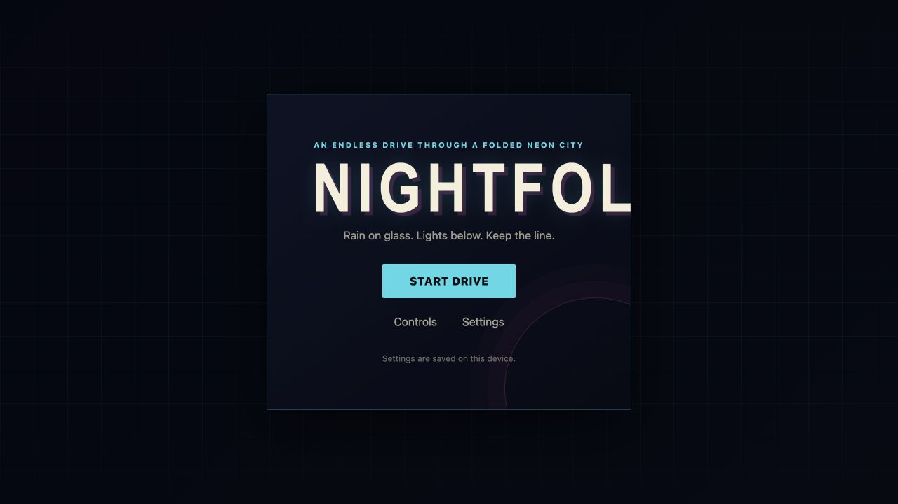

# Nightfold / 夜叠

An endless drive through a folded neon city.

Nightfold is a pseudo-3D night driving experience running in a modern browser
using HTML5 Canvas 2D. Drive along procedurally generated mountain city roads
through curves, slopes, elevated highways, tunnels, and rainy neon nights.



## Quick Start

```bash
npm install
npm run dev
```

Open the URL shown in the terminal (usually `http://localhost:5173`).

The title screen is the entry point: choose **Start drive** to begin. Open
**Settings** before or during a run to choose Low / Medium / High quality and
adjust weather intensity. These two settings are kept in local storage.

## Controls

| Key | Action |
|---|---|
| `ArrowUp` / `W` | Accelerate |
| `ArrowDown` / `S` | Brake |
| `ArrowLeft` / `A` | Steer left |
| `ArrowRight` / `D` | Steer right |
| `P` / `Escape` | Pause |
| `R` | Reset to road center |
| `F` | Toggle fullscreen |
| `[` / `]` | Decrease / increase weather intensity |

## Scripts

| Command | Description |
|---|---|
| `npm run dev` | Start development server |
| `npm run build` | Type-check and build for production |
| `npm run preview` | Preview the production build |
| `npm run typecheck` | Run TypeScript type checking |
| `npm run lint` | Run ESLint |
| `npm run test` | Run Vitest tests |

## Tech Stack

- Vite + TypeScript (strict mode)
- HTML5 Canvas 2D
- Vitest for testing
- ESLint + Prettier

No runtime dependencies.

## Browser Support

- Chrome
- Edge
- Safari

Primary target device: MacBook M1 Pro.

## Project Status

Phase 5 is **complete** — rain-night atmosphere and speed feel are frozen.
See `nightfold_impl_docu.md` for the full implementation plan.

Phase 5 includes a fixed-count screen-space rain layer, speed-linked rain
motion, restrained wet-road highlights, high-speed lines and camera shake,
braking/off-road feedback, and adjustable weather intensity. The default
intensity is 65%; use `[` and `]` during play, or start with `?weather=0..1`.

Phase 6 is **complete** — productized entry flow, settings, controls, errors,
fullscreen, and a GitHub Pages workflow are included. The workflow publishes
on pushes to `main` after the full verification suite passes.

## GitHub Pages

The repository includes a GitHub Actions workflow for Pages. Enable GitHub
Pages with **GitHub Actions** as the source, then push to `main`; the workflow
runs the full check suite and publishes the `dist/` build. The Vite base path
is configured for a repository named `nightfold`.
